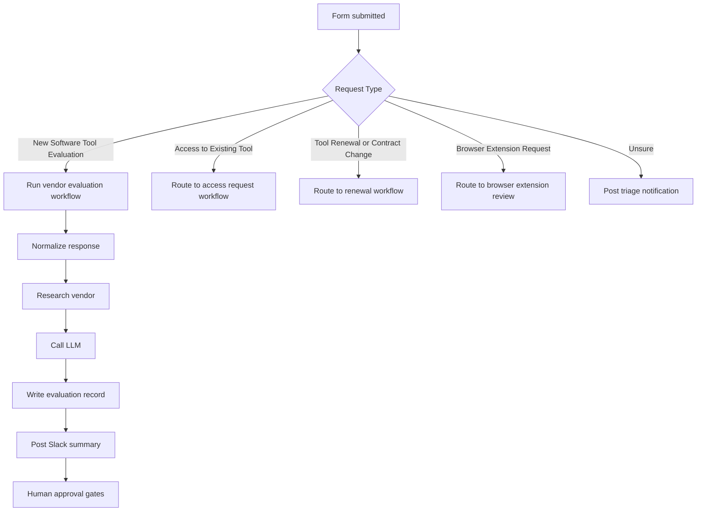
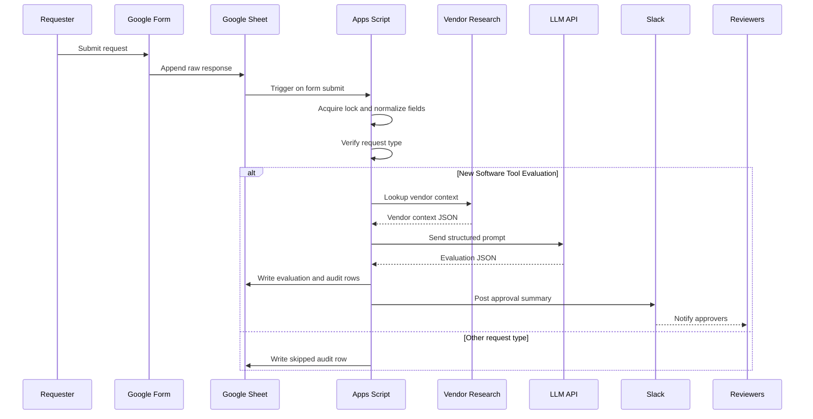
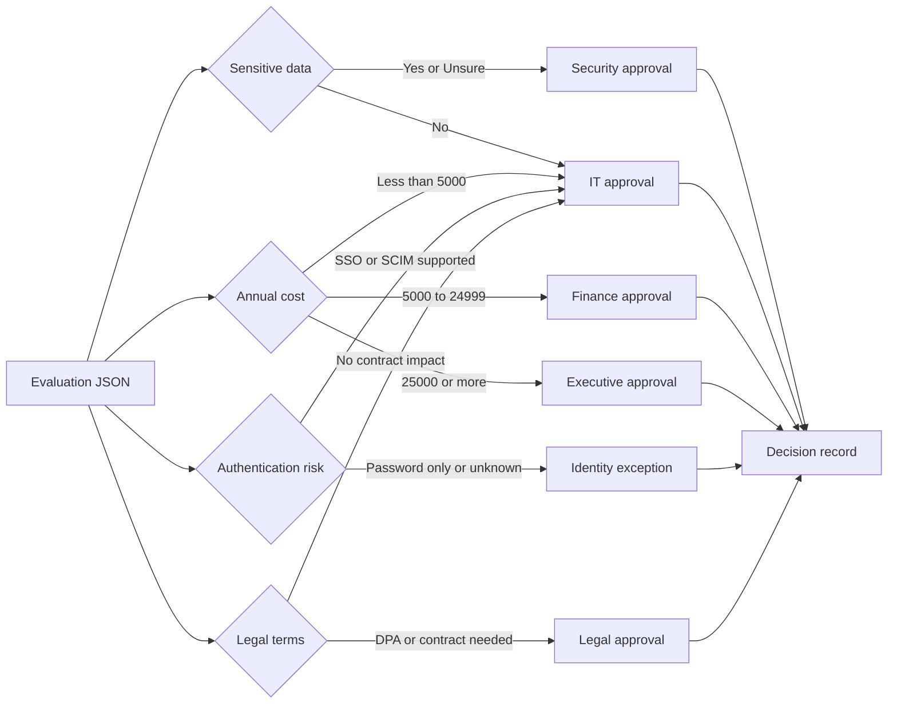
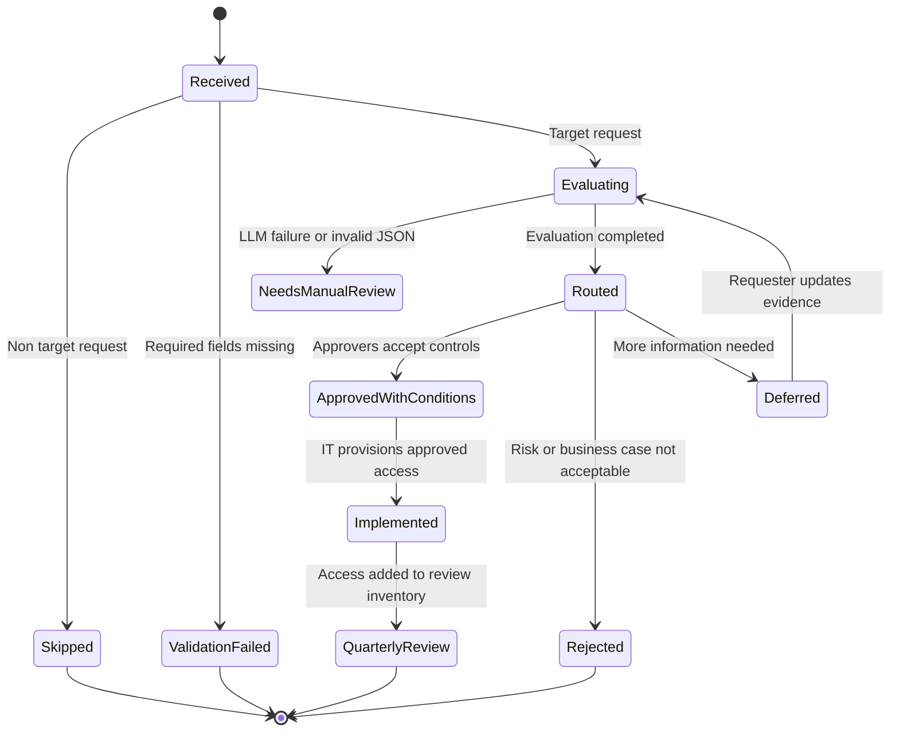
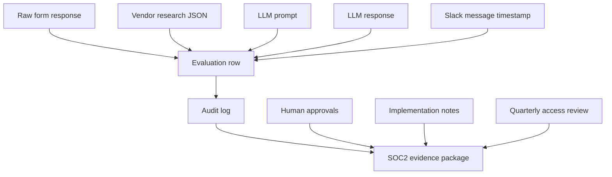

# Task 1 - Workflow Diagrams

## Intake Branching

```mermaid
flowchart TD
    A[Form submitted] --> B{Request Type}
    B -->|New Software Tool Evaluation| C[Run vendor evaluation workflow]
    B -->|Access to Existing Tool| D[Route to access request workflow]
    B -->|Tool Renewal or Contract Change| E[Route to renewal workflow]
    B -->|Browser Extension Request| F[Route to browser extension review]
    B -->|Unsure| G[Post triage notification]
    C --> H[Normalize response]
    H --> I[Research vendor]
    I --> J[Call LLM]
    J --> K[Write evaluation record]
    K --> L[Post Slack summary]
    L --> M[Human approval gates]
```

## Apps Script Sequence

```mermaid
sequenceDiagram
    participant User as Requester
    participant Form as Google Form
    participant Sheet as Google Sheet
    participant Script as Apps Script
    participant Vendor as Vendor Research
    participant LLM as LLM API
    participant Slack as Slack
    participant Reviewer as Reviewers

    User->>Form: Submit request
    Form->>Sheet: Append raw response
    Sheet->>Script: Trigger on form submit
    Script->>Script: Acquire lock and normalize fields
    Script->>Script: Verify request type
    alt New Software Tool Evaluation
        Script->>Vendor: Lookup vendor context
        Vendor-->>Script: Vendor context JSON
        Script->>LLM: Send structured prompt
        LLM-->>Script: Evaluation JSON
        Script->>Sheet: Write evaluation and audit rows
        Script->>Slack: Post approval summary
        Slack-->>Reviewer: Notify approvers
    else Other request type
        Script->>Sheet: Write skipped audit row
    end
```

## Approval Routing

```mermaid
flowchart LR
    A[Evaluation JSON] --> B{Sensitive data}
    A --> C{Annual cost}
    A --> D{Authentication risk}
    A --> E{Legal terms}

    B -->|Yes or Unsure| F[Security approval]
    B -->|No| G[IT approval]

    C -->|Less than 5000| G
    C -->|5000 to 24999| H[Finance approval]
    C -->|25000 or more| I[Executive approval]

    D -->|SSO or SCIM supported| G
    D -->|Password only or unknown| J[Identity exception]

    E -->|DPA or contract needed| K[Legal approval]
    E -->|No contract impact| G

    F --> L[Decision record]
    G --> L
    H --> L
    I --> L
    J --> L
    K --> L
```

## Workflow State Machine

```mermaid
stateDiagram-v2
    [*] --> Received
    Received --> Skipped: Non target request
    Received --> ValidationFailed: Required fields missing
    Received --> Evaluating: Target request
    Evaluating --> NeedsManualReview: LLM failure or invalid JSON
    Evaluating --> Routed: Evaluation completed
    Routed --> ApprovedWithConditions: Approvers accept controls
    Routed --> Rejected: Risk or business case not acceptable
    Routed --> Deferred: More information needed
    ApprovedWithConditions --> Implemented: IT provisions approved access
    Rejected --> [*]
    Deferred --> Evaluating: Requester updates evidence
    Implemented --> QuarterlyReview: Access added to review inventory
    QuarterlyReview --> [*]
    Skipped --> [*]
    ValidationFailed --> [*]
```

## Evidence Flow

```mermaid
flowchart TD
    A[Raw form response] --> B[Evaluation row]
    C[Vendor research JSON] --> B
    D[LLM prompt] --> B
    E[LLM response] --> B
    F[Slack message timestamp] --> B
    B --> G[Audit log]
    G --> H[SOC2 evidence package]
    I[Human approvals] --> H
    J[Implementation notes] --> H
    K[Quarterly access review] --> H
```
