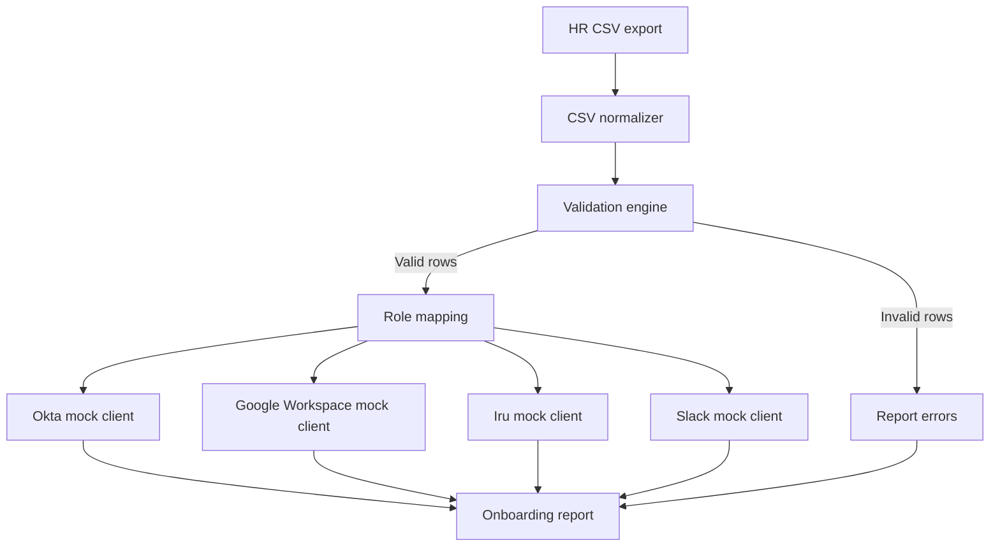

# Task 2 - Onboarding Automation Architecture

## Purpose

Task 2 documents a maintainable onboarding automation for Balto Software. The workflow reads a messy HR CSV, validates new hire records, maps employees to least privilege access, and produces an onboarding report. The implementation uses mocks for Okta, Google Workspace, Iru, Slack, and OpenAI so another engineer can test the logic without production credentials.

This document intentionally avoids code and focuses on engineering decisions.

## Operating Assumptions

- Balto has about 75 employees and a one-person IT team.
- Employees are remote and may work from multiple countries.
- Okta is the intended identity control plane, but role based access control is imperfect.
- Google Workspace is used for email, groups, calendars, and shared drives.
- Iru is used for endpoint provisioning through department blueprints.
- Secrets are stored in `.env`.
- CSV exports from HR are imperfect and may include inconsistent headers, date formats, whitespace, duplicate rows, or missing managers.

## Recommended Flow

1. HR exports a CSV of upcoming new hires.
2. IT runs `onboarding.py --csv sample_new_hires.csv`.
3. The automation normalizes headers and validates each row.
4. Invalid rows are reported and skipped.
5. Valid rows are enriched with role, department, country, and manager logic.
6. Mock Okta creates users and assigns approved groups.
7. Mock Google Workspace creates accounts, assigns licenses, and adds groups.
8. Mock Iru assigns endpoint blueprint.
9. Mock Slack generates a welcome message using OpenAI if available, otherwise a fallback template.
10. A structured JSON report is printed or written to file.

## Architecture Diagram

## Okta Strategy

| Recommendation | Reason | Tradeoff | Risk | Alternative considered |
|---|---|---|---|---|
| Create a baseline Okta group for every employee. | Gives default access such as SSO portal and security training. | Baseline must be carefully limited. | Overloaded baseline groups can become hidden privilege. | Assign no baseline group, rejected because basic services need consistency. |
| Map role-specific access through approved groups only. | Supports least privilege and auditability. | Imperfect RBAC means some manual review remains. | Overbroad role groups can grant unnecessary application access. | Manual per-user assignment, rejected as error prone. |
| Treat privileged roles as manager-approved. | Higher risk access needs separation of duties. | Slower onboarding for Engineering, Finance, and IT. | Privileged access without approval becomes a SOC2 issue. | Auto-assign all role groups, rejected. |
| Keep an allowlist of automation-assignable groups. | Prevents CSV values from injecting arbitrary group assignment. | Requires updates when new groups are approved. | Without allowlist, a malformed CSV could assign admin access. | Trust HR CSV group fields, rejected. |

## Google Workspace Licenses

| User type | Recommended license | Reason | Tradeoff | Risk | Alternative considered |
|---|---|---|---|---|---|
| Full-time employee | Business Standard or approved company baseline | Provides mail, drive, calendar, meet, and standard collaboration. | Cost scales with headcount. | Under-licensing blocks work. | Assign only on first login, rejected because onboarding should be ready on day one. |
| Executive, Legal, Finance, Engineering leadership | Business Plus if retention or advanced controls are required | Better compliance and investigation capabilities. | Higher cost. | Not all employees need advanced features. | Give everyone highest license, rejected for cost. |
| Contractor | Least required license, time-boxed | Reduces cost and exposure. | More tracking. | Contractor accounts may remain active after end date. | Personal accounts, rejected. |

## Distribution Lists and Google Groups

| Group type | Example | Assignment source | Security note |
|---|---|---|---|
| Department group | `engineering@balto.com` | Department mapping | Should not grant production access by itself. |
| Location or country group | `india-employees@balto.com` | Country validation | Useful for payroll and policy communications. |
| All hands group | `all@balto.com` | Baseline | Restrict posting permissions. |
| Sensitive app group | `finance-systems@balto.com` | Role and manager approval | Must be allowlisted and reviewed quarterly. |

## Iru Blueprints

| Department | Blueprint | Reason | Tradeoff | Risk | Alternative considered |
|---|---|---|---|---|---|
| Engineering | `iru-blueprint-engineering` | Developer tooling, device security, and code environment. | More software installed by default. | Over-installation increases attack surface. | One blueprint for all, rejected. |
| Sales | `iru-blueprint-sales` | CRM, video tools, and call workflows. | Requires upkeep when sales stack changes. | Missing tools slow ramp. | Manual setup, rejected. |
| Customer Success | `iru-blueprint-customer-success` | Customer support and collaboration tooling. | May overlap with Sales. | Access sprawl if not reviewed. | Use Sales blueprint, rejected because CS access differs. |
| G&A | `iru-blueprint-general-admin` | Finance, People, Legal support tools. | Sensitive apps need additional approval. | Overbroad finance/legal tools. | Department sub-blueprints later. |

## Country Considerations

| Country factor | Handling | Reason | Tradeoff | Risk | Alternative considered |
|---|---|---|---|---|---|
| Allowed hiring countries | Validate against configured allowlist. | Prevents unsupported employment locations. | Requires People Ops updates. | Unapproved countries can create tax, legal, and device logistics issues. | Accept all countries, rejected. |
| Data residency needs | Flag countries requiring privacy review. | Remote SaaS companies may face regional privacy obligations. | Adds review time. | Incorrect handling can create compliance exposure. | Ignore until audit, rejected. |
| Device logistics | Include country in Iru payload. | Shipping and support differ by country. | Mocks cannot verify real carrier constraints. | Device not ready by start date. | Manual device emails only, rejected. |

## Manager Approval Logic

Manager approval is required when:

- The role is privileged.
- The department maps to sensitive systems.
- The country is not in the default supported list.
- Required manager email is missing or invalid.
- The job title cannot be mapped confidently.

| Recommendation | Reason | Tradeoff | Risk | Alternative considered |
|---|---|---|---|---|
| Require manager email for every hire. | Supports approval routing and access ownership. | HR must keep manager data current. | Missing manager weakens access accountability. | Infer manager from department, rejected. |
| Require approval ticket for privileged roles. | Creates SOC2 evidence before high-risk access. | Adds onboarding friction. | Privileged access without evidence is a control failure. | Post-approval after onboarding, rejected. |

## Messy CSV Handling

The automation should tolerate:

- Header aliases such as `First Name`, `first_name`, and `firstname`.
- Byte order marks.
- Leading and trailing whitespace.
- Blank lines.
- Multiple date formats.
- Duplicate email addresses.
- Optional personal email.
- Missing optional fields.

It should not tolerate:

- Missing first name, last name, work email, department, job title, country, start date, or manager email.
- Invalid work email domain.
- Duplicate work emails.
- Unsupported country.
- Privileged role without approval evidence.

## Validation Strategy

| Validation | Why it matters | Failure behavior |
|---|---|---|
| Required fields | Prevents incomplete account creation. | Skip row and report error. |
| Work email domain | Prevents external account injection. | Skip row and report error. |
| Date parsing | Start date drives scheduling and license timing. | Skip row on invalid date. |
| Duplicate email detection | Prevents duplicate identities. | Skip duplicate rows. |
| Country allowlist | Prevents unsupported employment and device routing. | Skip or require HR review depending policy. |
| Role mapping confidence | Prevents over-provisioning. | Use baseline only or skip privileged assignment pending approval. |
| Manager approval evidence | Preserves separation of duties. | Skip privileged access and report missing approval. |

## Failure Handling

| Failure | Handling | Evidence |
|---|---|---|
| CSV cannot be read | Exit with clear error. | Log message and nonzero exit. |
| Invalid row | Continue processing other rows. | Report row number and errors. |
| API mock failure | Record failed step and continue where safe. | Structured report entry. |
| Slack generation failure | Use fallback template. | Report `fallback_used=true`. |
| Duplicate account | Treat as idempotent skip if payload matches. | Mock response includes existing user status. |

## Production Improvements

| Improvement | Reason | Tradeoff | Risk | Alternative considered |
|---|---|---|---|---|
| Replace mocks with official APIs. | Real provisioning requires Okta, Google, Slack, and Iru integrations. | Requires secrets, API scopes, retries, and rate limit handling. | Over-scoped API tokens can violate least privilege. | Manual provisioning, acceptable only short term. |
| Add ticket creation for invalid rows. | HR can fix data without Slack back-and-forth. | Adds integration. | Invalid rows may be missed. | Email CSV errors, weaker tracking. |
| Add unit tests around validators and mappings. | Prevents silent access regressions. | More maintenance. | Mapping changes can grant wrong access. | Manual testing, rejected for production. |
| Add dry-run approval review. | Lets IT preview access before provisioning. | Adds one more step. | Automated bad mappings could provision access. | Direct execution only, risky. |
| Add SCIM lifecycle reconciliation. | Ensures onboarding and offboarding stay aligned. | More integration complexity. | Orphaned accounts. | Quarterly manual checks only, minimum viable. |
