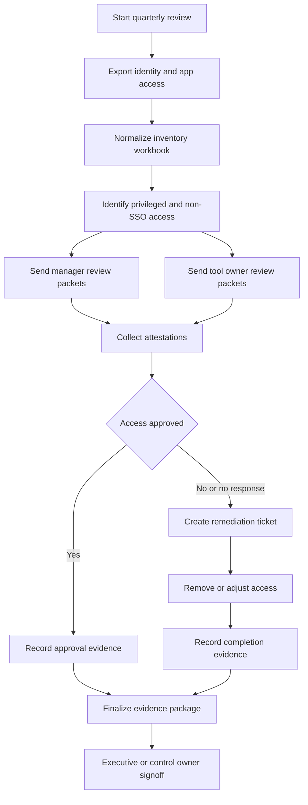

# Task 4 - Quarterly Access Review

## Purpose

This runbook defines a complete quarterly access review for Balto Software. It is designed for a 75-person remote SaaS company with a one-person IT team, Google Workspace, Okta, Slack, Iru, imperfect Okta RBAC, and a mixture of SSO and non-SSO SaaS tools.

The goal is not to create a ceremonial spreadsheet. The goal is to prove that Balto periodically verifies user access, removes inappropriate access, and documents manager or owner attestation.

## Review Cadence

| Activity | Cadence | Owner | Evidence |
|---|---|---|---|
| Access inventory export | Quarterly, first week | IT | Export files and workbook tab. |
| Manager review | Quarterly, second week | Managers | Completed manager attestation rows. |
| Privileged access review | Quarterly, second week | IT and Security | Privileged access tab and decisions. |
| Non-SSO tool review | Quarterly, second and third week | Tool owners | Vendor admin export or owner attestation. |
| Remediation | Quarterly, third week | IT | Deprovisioning tickets and timestamps. |
| Evidence package finalization | Quarterly, fourth week | IT | Final PDF or folder package. |

## Recommendation Summary

| Recommendation | Reason | Tradeoff | Risk | Alternative considered |
|---|---|---|---|---|
| Run reviews quarterly, not annually. | Balto is remote and SaaS-heavy; access changes frequently. | More recurring work for IT and managers. | Annual reviews leave orphaned access active too long. | Annual review, rejected for SOC2 and security posture. |
| Use manager attestation for employee access and owner attestation for shared or non-SSO tools. | Managers know job need; tool owners know app-specific access. | Requires two review tracks. | A single reviewer may not understand every app. | IT-only review, rejected because IT cannot validate business need alone. |
| Keep the first version in Google Sheets. | Low maintenance and easy evidence export. | Sheets are not a full GRC platform. | Manual steps can drift. | Vanta/Drata immediately, better later but costlier. |
| Prioritize privileged and non-SSO access. | Highest risk access deserves deeper review. | Standard access may receive lighter review. | Overlooking a standard group that grants hidden access. | Review every field equally, too heavy for one-person IT. |

## Scope

Included:

- Okta users and groups.
- Google Workspace users and groups.
- Admin roles in Google Workspace.
- Slack workspace users and admin roles.
- GitHub, CRM, finance, HRIS, support, production, and customer data tools.
- Non-SSO tools tracked in the vendor inventory.
- Shared accounts, service accounts, and break-glass accounts.
- Contractors and temporary workers.

Excluded only with written justification:

- Customer-managed systems not administered by Balto.
- Decommissioned tools with evidence of shutdown.
- Test tenants with no active users or data.

## Review Workflow



## Evidence Package

Create a quarterly folder named:

`Access Review - FY2026 Q3`

Required contents:

| Artifact | Description | Reason |
|---|---|---|
| `Access_Review_Workbook.xlsx` or Google Sheet export | Master review workbook. | Primary evidence for population, review, decisions, and remediation. |
| Okta export | Users, groups, apps, admins. | Identity source evidence. |
| Google Workspace export | Users, groups, admins, suspended users. | Collaboration and email access evidence. |
| Privileged access export | Admins, production, finance, HRIS, GitHub admins. | High-risk access evidence. |
| Non-SSO tool owner attestations | Tool owner signoff and user list. | Compensating control for tools outside Okta. |
| Remediation tickets | Removed access, owner, date, proof. | Shows review caused action. |
| Exceptions register | Approved exceptions, owner, expiration. | Prevents permanent exceptions. |
| Final signoff | IT and Security or executive delegate. | Control completion evidence. |

## Workbook Schema

### Tab: Population

| Column | Purpose |
|---|---|
| User Email | Primary identity. |
| Name | Human readable. |
| Employment Type | Employee, contractor, service account. |
| Department | Manager routing. |
| Manager Email | Reviewer routing. |
| Country | HR and regional review. |
| Status | Active, suspended, terminated. |
| Source | Okta, Google, app export, manual. |

### Tab: Access Inventory

| Column | Purpose |
|---|---|
| User Email | User being reviewed. |
| System | Application or group source. |
| Access Name | Group, role, license, admin role. |
| Access Type | Standard, privileged, admin, service, shared. |
| SSO Status | Okta SSO, Google SSO, password-only, unknown. |
| Data Classification | Public, internal, confidential, customer, personal, production. |
| Owner | Tool or access owner. |
| Reviewer | Manager or tool owner. |
| Decision | Approved, remove, modify, needs info, no response. |
| Reason | Business justification. |
| Reviewed At | Timestamp. |
| Remediation Ticket | Link to action if needed. |

### Tab: Remediation

| Column | Purpose |
|---|---|
| Item ID | Unique remediation ID. |
| User Email | Target account. |
| System | System changed. |
| Required Action | Remove, downgrade, suspend, transfer ownership. |
| Owner | Person responsible. |
| Due Date | Closure target. |
| Completed At | Completion evidence. |
| Evidence Link | Screenshot, ticket, or export. |

### Tab: Exceptions

| Column | Purpose |
|---|---|
| Exception ID | Unique exception. |
| System | Tool or access. |
| User or Group | Exception subject. |
| Risk | Why exception exists. |
| Compensating Control | Manual review, restricted scope, expiration. |
| Owner | Business or technical owner. |
| Expiration Date | Must not be blank. |
| Approved By | Authorized exception approver. |

## Manager Workflow

1. IT filters the workbook by manager.
2. IT sends each manager a review packet containing their direct reports and access list.
3. Managers mark each access item:
   - Approved
   - Remove
   - Modify
   - Not sure
4. Managers provide a reason for any privileged access approval.
5. IT follows up on no-response managers after five business days.
6. No response after ten business days escalates to the manager's manager.

Manager message requirements:

- Plain language.
- Clear deadline.
- Reminder that approval means the access is still needed for the user's job.
- Link to the review Sheet.
- Instructions for `Remove` and `Not sure`.

## Non-SSO Strategy

Non-SSO tools are a known risk because Okta offboarding may not remove access. Balto should maintain a separate non-SSO tab with named owners.

| Control | Reason | Tradeoff | Risk | Alternative considered |
|---|---|---|---|---|
| Require a tool owner for every non-SSO app. | Someone must attest access remains appropriate. | Owner changes need tracking. | Orphaned apps persist after employee exits. | IT owns all non-SSO tools, rejected because IT lacks business context. |
| Require quarterly owner export or attestation. | Compensating control for lack of SSO lifecycle. | Manual work. | Offboarded users may remain active. | Trust expense data only, rejected. |
| Block customer data in password-only tools unless exception approved. | Reduces customer data exposure. | May limit tool choices. | Customer data could remain in weakly controlled apps. | Permit with annual review, rejected. |
| Track admin users separately. | Admin access has higher impact. | Extra review tab. | Admins may persist unnoticed. | Combine with standard users, rejected. |

## LLM Summarization Prompt

Use the LLM only after the workbook is assembled. Do not send secrets, customer records, or full personal details. Send minimized rows with email, department, system, access type, decision, and reviewer status.

```text
You are assisting Balto Software's IT team with a quarterly access review summary.

Context:
- Balto is a 75-person remote SaaS company.
- The review supports SOC2 evidence.
- Okta RBAC is imperfect.
- Non-SSO tools require compensating controls.
- The LLM must summarize, not approve access.

Input:
{{MINIMIZED_ACCESS_REVIEW_ROWS_JSON}}

Return JSON only:
{
  "summary": "string",
  "high_risk_items": [
    {
      "system": "string",
      "user_or_group": "string",
      "risk": "string",
      "why_it_matters": "string",
      "recommended_follow_up": "string"
    }
  ],
  "missing_reviews": [
    {
      "reviewer": "string",
      "count": 0,
      "systems": ["string"]
    }
  ],
  "remediation_summary": {
    "remove": 0,
    "modify": 0,
    "needs_info": 0
  },
  "soc2_evidence_gaps": ["string"],
  "executive_summary": "string"
}
```

## LLM Limitations

| Limitation | Why it matters | Control |
|---|---|---|
| LLM may misread access context | A group name may imply more or less privilege than it really has. | Human IT owner validates high-risk items. |
| LLM may hallucinate system facts | It may invent app capabilities not in the data. | Prompt forbids unsupported facts and reviewer checks output. |
| LLM should not see unnecessary personal data | Data minimization is a security control. | Send minimized rows only. |
| LLM cannot approve access | Approval must come from managers and owners. | Treat output as summary only. |

## Risk Analysis

| Risk | Likelihood | Impact | Mitigation |
|---|---|---|---|
| Terminated user remains in non-SSO app | Medium | High | Non-SSO owner attestation and offboarding checklist reconciliation. |
| Manager rubber-stamps all access | Medium | Medium | Require reason for privileged access and sample review by IT/Security. |
| Okta group names are misleading | Medium | Medium | Maintain group owner and description inventory. |
| Shared account lacks owner | Medium | High | Assign owner or retire account. |
| Service account has excessive permissions | Medium | High | Review token scopes and rotate credentials. |
| Review evidence is incomplete | Medium | High | Use required workbook fields and final checklist. |

## Migration to Vanta or Drata

| Phase | Action | Reason | Tradeoff | Risk | Alternative considered |
|---|---|---|---|---|---|
| Phase 1 | Keep Google Sheet review but align columns with GRC tool fields. | Makes later migration easier. | Some fields may feel redundant. | Rework during migration if fields differ. | Freeform Sheet, rejected. |
| Phase 2 | Connect Okta, Google Workspace, GitHub, and key apps. | Automates evidence collection. | Connector setup and cost. | Bad connector configuration can miss systems. | Manual exports forever, rejected long term. |
| Phase 3 | Move manager attestations into Vanta or Drata. | Stronger workflow tracking and reminders. | Managers need training. | Duplicate reviews if both Sheet and GRC remain active. | Keep attestations in Slack, weaker. |
| Phase 4 | Use GRC reports as audit package. | Reduces SOC2 preparation time. | Requires trust in tool data quality. | Blind reliance can miss non-SSO tools. | Manual package, acceptable backup. |

## Final Signoff Checklist

- Population reconciled against HR roster.
- Okta and Google exports attached.
- Privileged access reviewed.
- Non-SSO tools reviewed.
- No-response managers escalated.
- Remediation tickets created.
- Remediation completed or exception approved.
- Exceptions have owners and expiration dates.
- Final evidence package exported.
- IT and Security signoff recorded.
